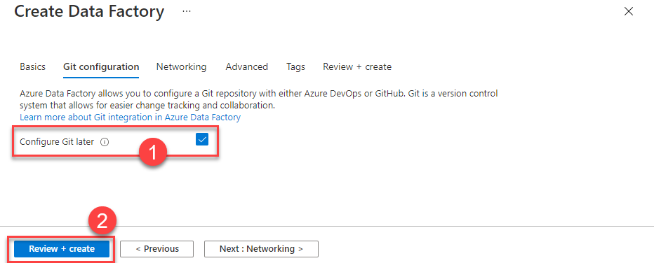
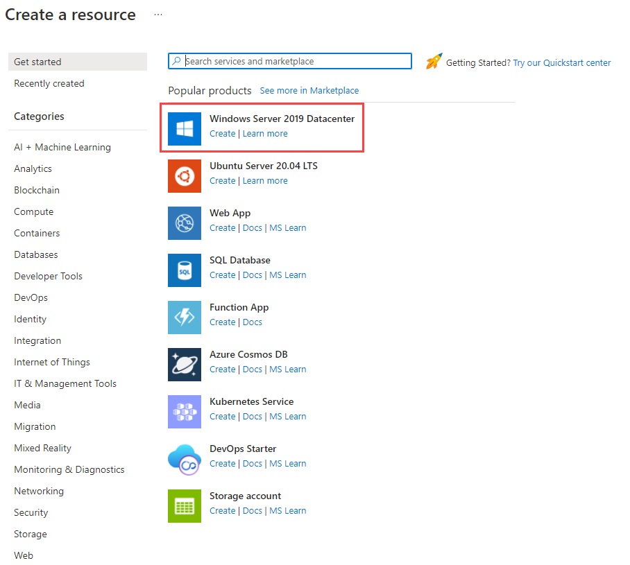
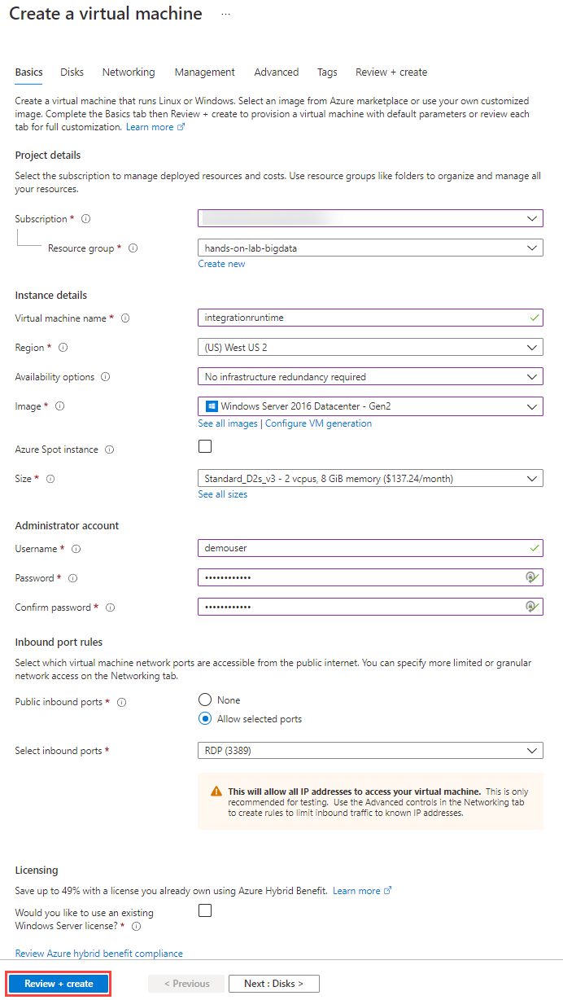
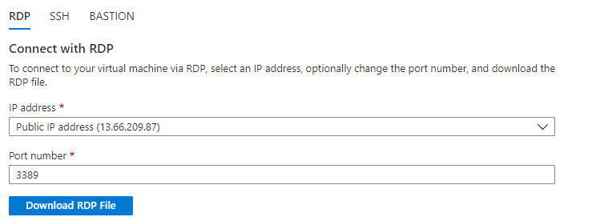
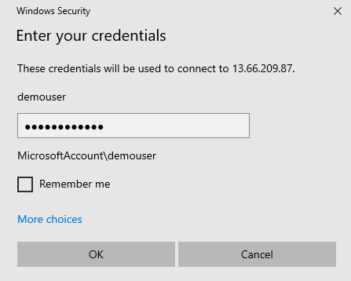
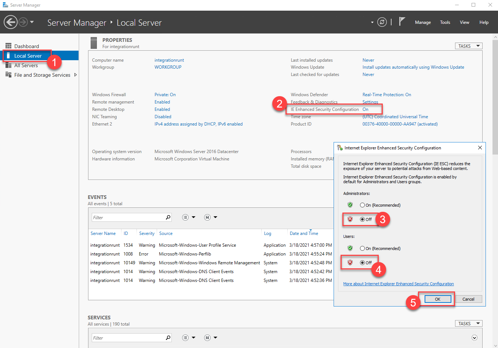

Big data and visualization

Before the hands-on lab setup guide

March 2021

Information in this document, including URL and other Internet Web site references, is subject to change without notice. Unless otherwise noted, the example companies, organizations, products, domain names, e-mail addresses, logos, people, places, and events depicted herein are fictitious, and no association with any real company, organization, product, domain name, e-mail address, logo, person, place or event is intended or should be inferred. Complying with all applicable copyright laws is the responsibility of the user. Without limiting the rights under copyright, no part of this document may be reproduced, stored in or introduced into a retrieval system, or transmitted in any form or by any means (electronic, mechanical, photocopying, recording, or otherwise), or for any purpose, without the express written permission of Microsoft Corporation.

Microsoft may have patents, patent applications, trademarks, copyrights, or other intellectual property rights covering subject matter in this document. Except as expressly provided in any written license agreement from Microsoft, the furnishing of this document does not give you any license to these patents, trademarks, copyrights, or other intellectual property.

The names of manufacturers, products, or URLs are provided for informational purposes only and Microsoft makes no representations and warranties, either expressed, implied, or statutory, regarding these manufacturers or the use of the products with any Microsoft technologies. The inclusion of a manufacturer or product does not imply endorsement of Microsoft of the manufacturer or product. Links may be provided to third party sites. Such sites are not under the control of Microsoft and Microsoft is not responsible for the contents of any linked site or any link contained in a linked site, or any changes or updates to such sites. Microsoft is not responsible for webcasting or any other form of transmission received from any linked site. Microsoft is providing these links to you only as a convenience, and the inclusion of any link does not imply endorsement of Microsoft of the site or the products contained therein.

© 2021 Microsoft Corporation. All rights reserved.

Microsoft and the trademarks listed at <https://www.microsoft.com/en-us/legal/intellectualproperty/Trademarks/Usage/General.aspx> are trademarks of the Microsoft group of companies. All other trademarks are property of their respective owners.

**Contents**

<!-- TOC -->

- [Big data and visualization before the hands-on lab setup guide](#big-data-and-visualization-before-the-hands-on-lab-setup-guide)
  - [Requirements](#requirements)
  - [Before the hands-on lab](#before-the-hands-on-lab)
    - [Task 1: Provision Azure Databricks](#task-1-provision-azure-databricks)
    - [Task 2: Create Azure Storage account](#task-2-create-azure-storage-account)
    - [Task 3: Create a storage container](#task-3-create-a-storage-container)
    - [Task 4: Provision Azure Data Factory](#task-4-provision-azure-data-factory)
    - [Task 5: Download and install Power BI Desktop](#task-5-download-and-install-power-bi-desktop)
    - [Task 6: (Optional) Provision a VM to install the Integration Runtime On](#task-6-optional-provision-a-vm-to-install-the-integration-runtime-on)

<!-- /TOC -->

# Big data and visualization before the hands-on lab setup guide

## Requirements

1. Microsoft Azure subscription must be pay-as-you-go or MSDN.

   - Trial subscriptions will not work.

2. If you are not a Service Administrator or Co-administrator for the Azure subscription, or if you are running the lab in a hosted environment, you will need to install [Visual Studio 2019 Community](https://visualstudio.microsoft.com/downloads/) with the **ASP.NET and web development** and **Azure development** workloads.

## Before the hands-on lab

Duration: 30 minutes

In this exercise, you will set up your environment for use in the rest of the hands-on lab. You should follow all the steps provided in the Before the Hands-on Lab section to prepare your environment _before_ attending the hands-on lab.

### Task 1: Provision Azure Databricks

Azure Databricks is an Apache Spark-based analytics platform optimized for Azure. It will be used in this lab to build and train a machine learning model used to predict flight delays.

1. In the [Azure Portal](https://portal.azure.com) (<https://portal.azure.com>), select **Create a resource** within the portal menu, then type "Azure Databricks" into the search bar. Select **Azure Databricks** from the results.

   

2. Select **Create**.

   

3. Set the following configuration on the Azure Databricks Service creation form:

   - **Subscription (1)**: Select the subscription you are using for this hands-on lab.
  
   - **Resource Group (2)**: Select **Create new** and enter a unique name, such as `hands-on-lab-bigdata`.

   - **Workspace name (3)**: Enter a unique name, this is indicated by a green checkmark.
  
   - **Location (4)**: Select a region close to you. **_(If you are using an Azure Pass, select South Central US.)_**

   - **Pricing (5)**: Select **Premium (+ Role-based access controls)**

   

4. Select **Review + Create (6)**.

5. Wait for validation to pass, then select **Create**.

### Task 2: Create Azure Storage account

Create a new Azure Storage account that will be used to store historic and scored flight and weather data sets for the lab.

1. In the [Azure Portal](https://portal.azure.com) (<https://portal.azure.com>), select **Create a resource** within the portal menu, then type "storage" into the search bar.

   

2. Select **Create (2)** and select **Storage Account (3)**.

   

3. Set the following configuration on the Azure Storage account creation form:

   - **Subscription (1)**: Select the subscription you are using for this hands-on lab.

   - **Resource group (2)**: Select the same resource group you created at the beginning of this lab.

   - **Storage account name (3)**: Enter a unique name, this is indicated by a green checkmark.

   - **Location (4)**: Select the same region you used for Azure Databricks.

   - **Performance (5)**: **Standard**

   - **Account kind (6)**: **StorageV2**

   - **Replication (7)**: **Read-access geo-redundant storage (RA-GRS)**

   

4. Select **Review + create (8)**.

5. Wait for validation to pass, then select **Create**.

### Task 3: Create a storage container

In this task, you will create a storage container to store your flight and weather data files.

1. From the home page in the Azure portal, choose **Resource groups**, then enter your resource group name into the filter box, and select it from the list.

   

2. Next, select your lab Azure Storage account from the list.

   

3. Select **Containers (1)** from the menu. Select **+ Container (2)** on the Containers blade, enter **sparkcontainer** for the name **(3)**, leaving the public access level set to Private. Select **Create (4)** to create the container.

   

### Task 4: Provision Azure Data Factory

Create a new Azure Data Factory instance that will be used to orchestrate data transfers for analysis.

1. In the [Azure Portal](https://portal.azure.com) (<https://portal.azure.com>), select **Create a resource** within the portal menu, then type "Data Factory" into the search bar.

   

2. Select **Create**.

   

3. Set the following configuration on the Data Factory creation form:

   - **Subscription (1)**: Select the subscription you are using for this hands-on lab.

   - **Resource Group (2)**: Select the same resource group you created at the beginning of this lab.

   - **Region (3)**: Select any region close to you.

   - **Name (4)**: Enter a unique name, this is indicated by a green checkmark.

   - **Version (5)**: Select **V2**

   **_Understanding Data Factory Location:_**
   The Data Factory location is where the data factory's metadata is stored and where the triggering of the pipeline is initiated from. Meanwhile, a data factory can access data stores and compute services in other Azure regions to move data between data stores or process data using compute services. This behavior is realized through the [globally available IR](https://azure.microsoft.com/en-us/global-infrastructure/services/?products=data-factory) to ensure data compliance, efficiency, and reduced network egress costs.

   The IR Location defines the location of its back-end compute, and essentially the location where the data movement, activity dispatching, and SSIS package execution are performed. The IR location can be different from the location of the data factory it belongs to.

   

4. Select **Next: Git configuration > (6)** to continue.

5. Check **Configure Git later (1)** and select **Review + create (2)** to proceed.

   

6. Select **Create** to finish and submit.

### Task 5: Download and install Power BI Desktop

Power BI desktop is required to connect to your Azure Databricks environment when creating the Power BI dashboard.

1. Download and install [Power BI Desktop](https://powerbi.microsoft.com/desktop/).

### Task 6: (Optional) Provision a VM to install the Integration Runtime On

An integration runtime agent for Azure Data Factory will need to be installed on your hardware for the hands-on lab. Since you will need to provide your user credentials, we suggest you provision an Azure VM to act as your "on-premises" hardware.

1. In the [Azure Portal](https://portal.azure.com) (<https://portal.azure.com>), select **Create a resource** within the portal menu, then type "Data Factory" into the search bar.

   

2. Select **Windows Server 2016 Datacenter** from Azure Marketplace.

   

3. On the **Create a virtual machine** page, specify the following parameters:

   - **Subscription (1)**: Provide the subscription you have been using for this lab.

   - **Resource group (2)**: Provide your resource group.

   - **Virtual machine name (3)**: Provide something descriptive.

   - **Region (4)**: Provide the same location as your ADF instance.

   - **Availability options**: No infrastructure redundancy required

   - **Image**: Windows Server 2016 Datacenter - Gen1

   - **Azure Spot instance**: Unselected

   - **Size (5)**: Standard_D2s_v3

   - **Username (6)**: demouser

   - **Password/Confirm password (6)**: Password.1!!

   - **Public inbound ports**: Allow selected ports

   - **Select inbound ports**: RDP (3389)

   - **Would you like to use an existing Windows Server license?** No

   

4. select **Review + create (7)** to proceed.

5. Select **Create** on the validation page to finish and start provisioning your VM. When the deployment is complete **(1)**, select **Go to resource (2)** to navigate to your VM.

   

6. Select **Connect** from the upper left-hand corner of the page. Then, select **RDP**. Finally, select **Download RDP File**.

   

7. Open the RDP file. Enter the username and password you configured earlier. Disregard any certificate issues that RDP presents.

   

8. When you access the VM, **Server Manager** should open automatically. If not, open it manually using the search bar. Then, locate **Local Server (1)**. Select **IE Enhanced Security Configuration**. Then, disable this feature for Administrators.

   

You should follow all these steps provided _before_ attending the Hands-on lab.
